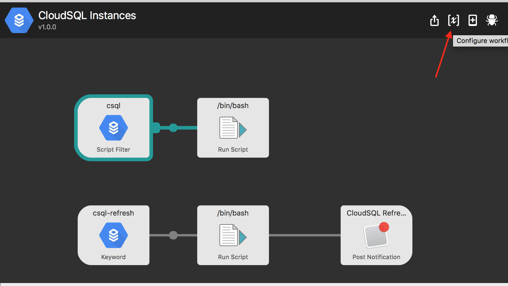

# Avoid CloudSQL Console Slowdowns
Easily navigate to the db you want

## Requirements
- Ruby 2.3.3
- A program that lists your cloudsql instances. This workflow currently relies on a closed-source implementation. Feel free to modify `csql` for your own needs. The workflow will look for a program pointed to by `CLOUD_SQL_PATH`. 

## Usage

`csql [QUERY]`

Press enter to open the CloudSQL instance in your browser

`csql-refresh`

press enter to update the cache of CloudSQL instances (default TTL = 300 seconds)

## Setup

**1. Install the workflow**

You can download the workflow from the [releases page](#)
This workflow requires Alfred 3.

**2. Environment variables**
You will need to set the path to the CLI tool that lists your CloudSQL instances. Set `CLOUD_SQL_PATH` in your workflow environment variables accordingly.

**3. Credentials**

This implementation relies on the calling program (pointed to by `CLOUD_SQL_PATH`) to properly set up the client. Check the Google docs if you require more information on authenticating.

**4. Ruby Dependencies**

This workflow is built and tested with Ruby 2.3.3. You will also need the `google-api-client` gem installed on your system. Run `gem install google-api-client` to install the necessary gem.

