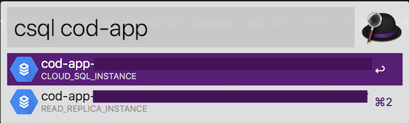
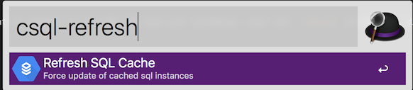
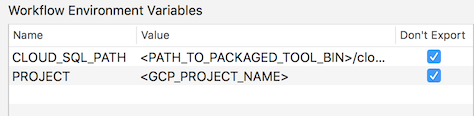

# Avoid CloudSQL Console Slowdowns
Navigating Google Cloud Console's SQL list can be annoyingly slow once your instances grow beyond a certain size. Avoid the pain with this Alfred workflow that grabs and caches all your SQL instance names for a given project and lets you search them easily. Once you find the instance you're looking for just press `enter` and your browser will open with the dashboard for that instance. Easy!

## Included
- A simple go client to connect to the SQL API and list instances. Just run `./build` in the `go` directory of the workflow and add the resulting `cloudsql` binary to `CLOUD_SQL_PATH` in the workflow environment variables (see pic below). Built with Go 1.9.2

## Requirements
- Alfred 3
- Go 1.9.2

## Usage

`csql [QUERY]`

Press enter to open the CloudSQL instance in your browser

`csql-refresh`

press enter to update the cache of CloudSQL instances (default TTL = 300 seconds)

## Setup

**1. Install the workflow**

You can download the workflow from the [releases page](#)
You will need to run `./build` in the `./go` directory of the workflow in order to install the client that fetches the list of your DB instances. Please note that this workflow requires Alfred 3. 

**2. Environment variables**
- Set `CLOUD_SQL_PATH` to the location of the `cloudsql` binary (source included in `go` folder)
- Set `PROJECT` to the name of the Google project you want to search.

**3. Credentials**

This workflow uses your default gcloud credentials (usually set via `gcloud auth application-default login`). Make sure your current identity has access to the target project.

