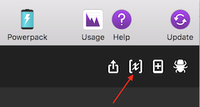

# Avoid CloudSQL Console Slowdowns
Easily navigate to the db you want

## Included
- A simple go client to connect to the SQL API and list instances. Just run `./build` in the `go` directory of the workflow.

## Requirements
- Alfred 3

## Usage

`csql [QUERY]`

Press enter to open the CloudSQL instance in your browser

`csql-refresh`

press enter to update the cache of CloudSQL instances (default TTL = 300 seconds)

## Setup

**1. Install the workflow**

You can download the workflow from the [releases page](#)
This workflow requires Alfred 3.

**2. Environment variables**
- Set `CLOUD_SQL_PATH` to the location of the `cloudsql` binary (source included in `go` folder)
- Set `PROJECT` to the name of the Google project you want to search. This workflow uses the `golang.org/x/oauth2/google` library and loads your system's default auth, so make sure it accords with the `PROJECT` variable.

**3. Credentials**

This implementation relies on the calling program (pointed to by `CLOUD_SQL_PATH`) to properly set up the client. Check the Google docs if you require more information on authenticating.

**4. Ruby Dependencies**

This workflow is built and tested with Ruby 2.3.3. You will also need the `google-api-client` gem installed on your system. Run `gem install google-api-client` to install the necessary gem.

